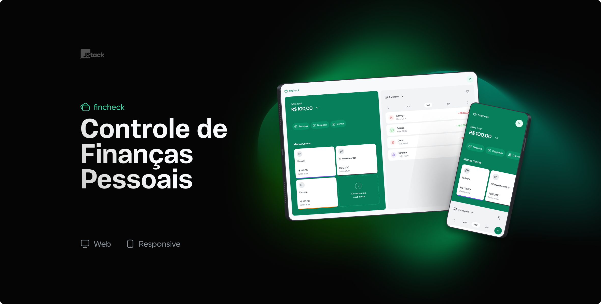

<h1 align="center">
  
</h1>


---

<div id='introducao'>

O **Fincheck** é uma aplicação voltada para o controle de finanças. Nele você pode gerenciar os seus gastos de uma forma otimizada, através do controle de suas contas bancárias, categorias de gastos e transações. Esse projeto foi desenvolvido utilizando algumas das stacks mais novas do mercado.
</div>

## Tópicos

* [Introdução](#introducao)
* [Instalar e rodar o projeto localmente](#instalacao)
* [Stack utilizada](#stack_utilizada)
* [Demonstração](#demonstração)
* [Aprendizados](#aprendizados)
* [Contatos](#contatos)

<div id='instalacao'>

## Instalando e rodando o projeto localmente:

Para rodar o **Fincheck** em sua máquina é bem simples.

Você precisa ter instalado:

- Node.js v18
- Docker v4.17.1 e utilizar a imagem Postgres (https://hub.docker.com/_/postgres)
- NPM, Yarn ou yarn para a instalação dos pacotes (projeto desenvolvido com yarn)

Para a instalação dos pacotes você deve entrar em cada pasta individualmente
e rodar o comando `yarn`, pois neste projeto temos o _backend_ e o _frontend_.

Navegue para `../api` e rode no terminal o comando:
```bash
yarn
```
Repita esse passo para `../frontend`.

Por padrão, o banco de dados vem totalmente vazio. Então para facilitar vou deixar uma _Collection_ que fiz com o Insomnia, para o gerenciamento completo da aplicação, (CRIAR, LISTAR E DELETAR USUÁRIOS, CONTAS BANCÁRIAS, CATEGORIAS E TRANSAÇÕES)

[Clique aqui para fazer o download](https://github.com/MateusJSouza/fincheck/blob/master/Insomnia_fincheck_collection.zip)

> Exemplo: Dentro do Insomnia basta importar a _Collection_ do Fincheck e começar a usar.
Vale lembrar que foi utilizado o token JWT para a autenticação, então eu exportei junto com a _collection_ as variáveis de ambiente. Basta fazer o _signup_ de uma nova conta, copiar e colar o token gerado dentro
das variáveis de ambiente, como *accessTokens.User1*. E no Insomnia, na aba de _Auth_, selecionar _Bearer_ e apertar _Crtl + Space_ e selecionar o *User1*. Por padrão todos os tokens tem *validade de 7 dias*.

### Rotas

Lembre-se de alterar as rotas da aplicação nos arquivos:
<div>
	
`\api\src\main.ts` altere o valor de `app.listen()` para a porta que você deseja que o banco rode.

	
`\api\src\main.ts` altere o valor da propriedade `origin` para a rote em que o seu _frontend_ vai rodar.
	

</div>

E mais um detalhe, a porta padrão do _frontend_ foi definida para `:3000`, e da _api_ para `:4000`.

Pronto, agora você está preparado para utilizar esta aplicação.
Para iniciar a _api_ basta rodar `yarn start:dev` ou `yarn start:docker` caso o processo do Docker esteja parado no Windows, em sua respectiva pasta.
E para iniciar o _frontend_ basta rodar `yarn dev` em sua respectiva pasta.  
</div>

<div id='stack_utilizada'>
<h2>Stack utilizada</h2>

**Back-end:**
- Node.js
- NestJs
- Prisma
- BCryptjs
- Docker
- Postgres
- TypeScript

**Front-end:**
- Vite
- React
- TypeScript
- TailwindCSS
- React Hook Forms (com Zod)
- React Query
- Radix UI (components e icones)
- React Hot Toast
- Swiper

> Em ambos foram utilizados o EditorConfig e Eslint para o desenvolvimento.

</div>

<div id='contatos' align="center">
  <p align="center">Made with 💜 by Mateus Jesus</p>
  <div id="contatos" align="center">
    <a href="https://www.linkedin.com/in/mateus-jesus/" target="_blank"></a>
</div>